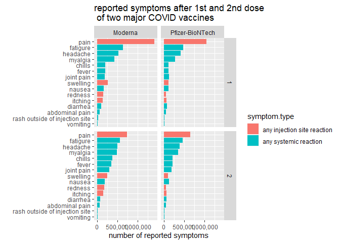
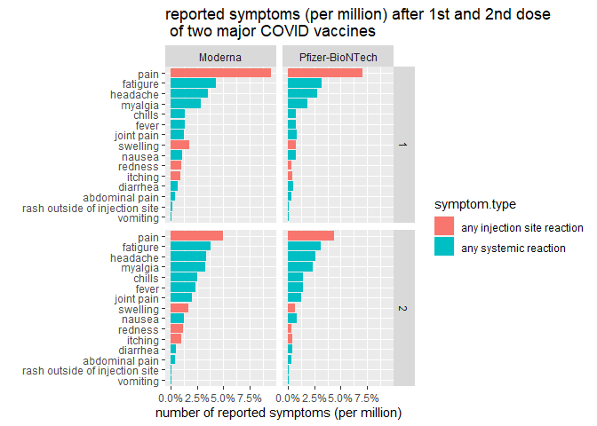
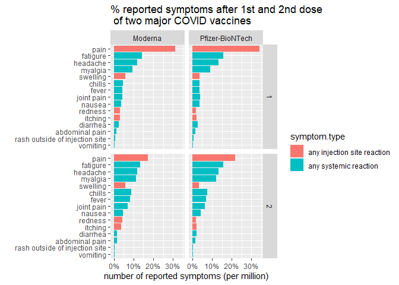

```r
library(tidyverse)
library(dplyr)
library(ggplot2)
library(scales)
```


```r
df <- read.csv("COVID_vaccine_side_effects.csv")
```


```r
df %>%  
  mutate(symptom = fct_reorder(symptom, number)) %>%
  ggplot(aes(symptom,number,fill=symptom.type)) +
  geom_col(position="dodge") +
  facet_grid(vars(Dose),vars(Vaccine))+
  scale_y_continuous(labels = comma)+
  labs(title="reported symptoms after 1st and 2nd dose \n of two major COVID vaccines",
       x="",
       y="number of reported symptoms")+
  coord_flip() 
```

<!-- -->

```r
df %>%  
  mutate(number=number/sum(number)) %>%
  mutate(symptom = fct_reorder(symptom, number)) %>%
  ggplot(aes(symptom,number,fill=symptom.type)) +
  geom_col(position="dodge") +
  facet_grid(vars(Dose),vars(Vaccine))+
  scale_y_continuous(labels = percent)+
  labs(title="reported symptoms (per million) after 1st and 2nd dose \n of two major COVID vaccines",
       x="",
       y="number of reported symptoms (per million)")+
  coord_flip() 
```

<!-- -->

```r
df %>%  
  group_by(Vaccine,Dose) %>%
  mutate(pct= prop.table(number)) %>%
  mutate(symptom = fct_reorder(symptom, pct)) %>%
  ggplot(aes(symptom,pct,fill=symptom.type)) +
  geom_col(position="dodge") +
  facet_grid(vars(Dose),vars(Vaccine))+
  scale_y_continuous(labels = percent)+
  labs(title="% reported symptoms after 1st and 2nd dose \n of two major COVID vaccines",
       x="",
       y="number of reported symptoms (per million)")+
  coord_flip() 
```

<!-- -->
